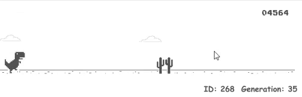
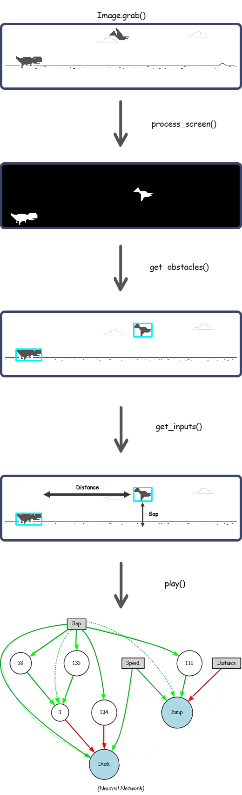
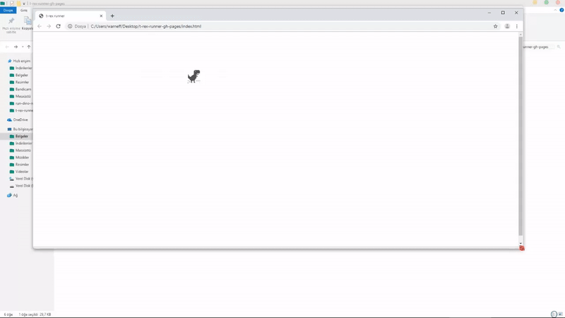
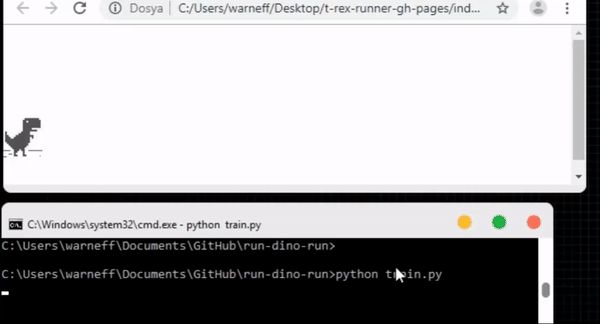

# AI learn how to play Google's dinosaur game
A simple artificial intelligence to teach Google Chrome's dinosaur game to play, using [NEAT](https://en.wikipedia.org/wiki/Neuroevolution_of_augmenting_topologies) (Neuroevolution of augmenting topologies) algorithm.


<p align="center"> 

</p>


## How it works

<p align="center"> 

</p>


## Dependencies
This project requires the following dependencies:
* [Python](https://www.python.org/downloads)(>= 3)
* [NumPy](http://www.numpy.org)
* [OpenCV](https://opencv.org/releases/)
* [Pillow](https://pillow.readthedocs.io/en/stable/installation.html)
* [pyautogui](https://pyautogui.readthedocs.io/en/latest/install.html)
* [neat-python](https://neat-python.readthedocs.io/en/latest/installation.html)
* [graphviz](https://pypi.org/project/graphviz/)
* [Graphviz executable](https://www.graphviz.org/download/)(==2.38)

*You have to install both graphviz library and graphviz's executable package*

## How To Use

* ### Install and prepare game
  1- Go to [t-rex-runner](https://github.com/wayou/t-rex-runner) and download zip file.

  2- Extract zip file.

  3- Open **index.js** with notepad or any text editor.

  4- Change all code in the index.js with [this](https://raw.githubusercontent.com/numancan/run-dino-run/master/__pycache__/index.txt?token=AJBXZ6GFU65WKDMVSQTO6WK47SPHW).

* ### Set position of game window
  1- Open **index.html**. You have to shrink the page like this:
  
  
  
  2- Set window position.
  
  


* ### Train the AI

  1- Run **train.py**. 
  
* ### Run trained AI

  1- Run **runwinner.py**. If you want to run which AI you want, you should write with .pkl file.
  Example:
 ```
  python runwinner.py best-genomes/best_378_2544.71.pkl
  ```
  
### **Warning!**
While running the code, you can't use your pc because simulating key presses for dino movement.


